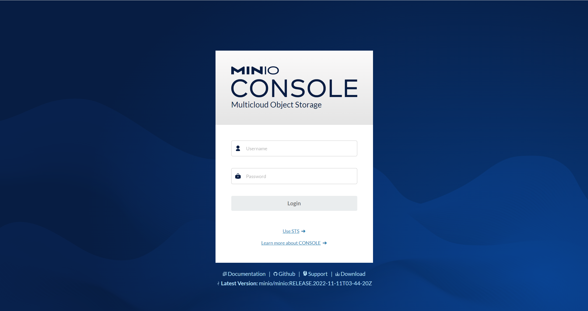

# Docker 安装 MinIO 详细步骤

::: tip 笔者说
笔者下面的步骤及配置是基于指定版本的实践，大多数程序大多数情况下在相差不大的版本时可以直接参考。（当然了，即使是非 Docker 方式安装程序也是一样道理）  
:::

## 拉取镜像

::: warning 笔者说
拉取镜像时需要明确镜像版本（Tag）。
:::

不指定版本（Tag）就拉取镜像，那拉取下来的镜像版本（Tag）默认是 `latest`（最新的）。`latest` 会跟随 Docker Registry 中的记录变化，现在拉取下来的 `latest` 是 x1 版本，但隔了一段时间后你在其他机器上再拉取 `latest` 可能就是 x2 版本了。

变化的版本，不利于生产环境部署的稳定。无论是后续在其他环境部署还是扩容集群等场景均要求根据架构要求指定好版本。

```shell
docker pull minio/minio:RELEASE.2022-08-02T23-59-16Z.fips
```

## 运行容器

::: warning 笔者说
**下方的配置，切记要根据个人实际情况来修改。**  
:::

- 容器的名称
- 镜像名称:版本
- 是否设置自启动？
- 是否端口映射？
- 环境变量配置
- 映射的话映射到宿主机哪个端口？
- 是否挂载卷？
- 挂载的话要挂载宿主机哪个目录？
- ......
- 等自定义配置

```shell
# MINIO_ACCESS_KEY：用户名，默认为 minioadmin
# MINIO_SECRET_KEY：用户密码，默认为 minioadmin
# MINIO_COMPRESS：开启压缩 on 开启 off 关闭
# MINIO_COMPRESS_EXTENSIONS：扩展名 .pdf,.doc 为空 所有类型均压缩
# MINIO_COMPRESS_MIME_TYPES：mime 类型 application/pdf 为空 所有类型均压缩
# MINIO_SERVER_URL：HTTPS 需要指定服务域名，例如：https://xxx.com:9000
# MINIO_BROWSER_REDIRECT_URL：HTTPS 需要指定服务域名，例如：https://xxx.com:9001
docker run -d \
--name minio minio/minio:RELEASE.2022-08-02T23-59-16Z.fips \
--restart=always \
-e TZ="Asia/Shanghai" \
-e MINIO_ACCESS_KEY="minioadmin" \
-e MINIO_SECRET_KEY="minioadmin" \
-e MINIO_COMPRESS="off" \
-e MINIO_COMPRESS_EXTENSIONS="" \
-e MINIO_COMPRESS_MIME_TYPES="" \
-p 9000:9000 -p 9001:9001 \
-v /opt/disk/docker/volumes/minio/conf:/root/.minio \
-v /opt/disk/docker/volumes/minio/data:/data \
server --address ':9000' --console-address ':9001' /data \
# 使用该参数，容器内的 root 用户才拥有真正的 root 权限
--privileged=true
```

## 验证

服务器开放好相应端口或设置好安全组规则后，访问 `http://宿主机IP:映射的端口` （例如按上方配置那就是：http://宿主机IP:9001）即可看到 MinIO 管理界面。



输入你刚才指定的用户名、密码，登录进来后，可以看到当前一个 Bucket 也没有，可以点击右侧的 [Create Bucket] 来创建。


## Docker Compose脚本

如果你是用的 docker-compose 来安装，下方附上相应 docker-compose.yml 脚本内容。

```yaml
version: '3'
services:
  minio:
    container_name: minio
    image: minio/minio:RELEASE.2022-08-02T23-59-16Z.fips
    restart: always
    environment:
      TZ: Asia/Shanghai
      MINIO_ACCESS_KEY: minioadmin
      MINIO_SECRET_KEY: minioadmin
      # HTTPS 需要指定域名
      #MINIO_SERVER_URL: 'https://xxx.com:9000'
      #MINIO_BROWSER_REDIRECT_URL: 'https://xxx.com:9001'
      # 开启压缩 on 开启 off 关闭
      MINIO_COMPRESS: 'off'
      # 扩展名 .pdf,.doc 为空 所有类型均压缩
      MINIO_COMPRESS_EXTENSIONS: ''
      # mime 类型 application/pdf 为空 所有类型均压缩
      MINIO_COMPRESS_MIME_TYPES: ''
    ports:
      - 9000:9000
      - 9001:9001
    volumes:
      - /opt/disk/docker/volumes/minio/conf:/root/.minio
      - /opt/disk/docker/volumes/minio/data:/data
    command: server --address ':9000' --console-address ':9001' /data
    privileged: true
```

编写好 docker-compose.yml 脚本后，在脚本同级目录执行下方命令即可。

```shell
docker-compose up -d
```

