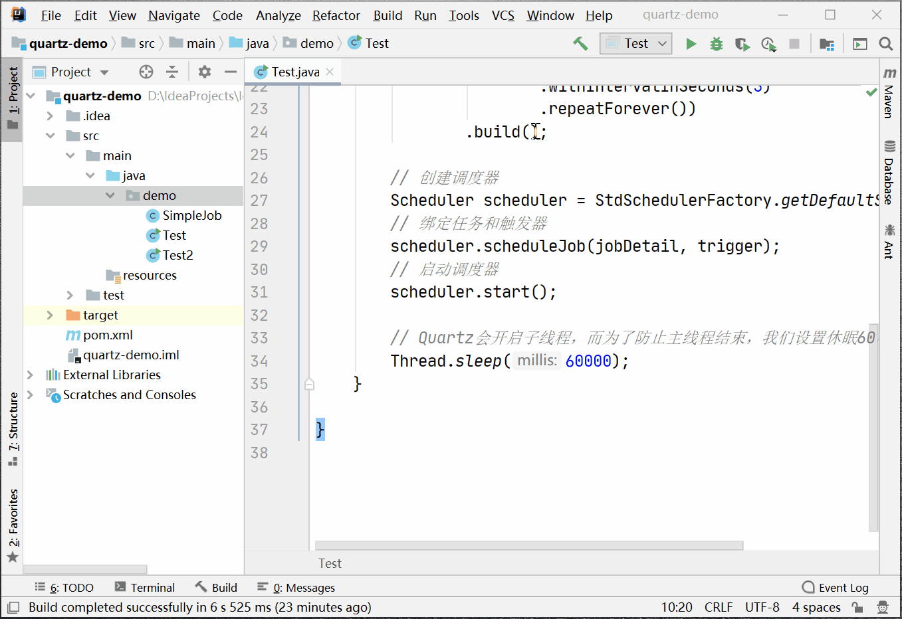

# Quartz 快速入门

## 前言

::: tip 空巢青年们有一句话是什么来着？
孤独到极致是什么感觉：只有 QQ 邮箱祝你生日快乐。
:::

笔者刚才也去翻了翻 QQ 邮箱以往的邮件，的确每年都有来自它的祝福，而且好几年都没换个花样儿。

如果你在各类平台都填写过生日信息，这个场景你应该也不陌生：在你填写的生日那天，这些平台比你的男女朋友还准时的出现了，初次见它们的你，一下子感动的不知所措，难道这就是爱吗？


很可惜，不是。这份 “宠爱” 是 “海王” 的 “雨露均沾”，是 “鱼塘塘主” 的 “千篇一律”。它们都是提前设置好的，每天都会进行的定时任务，只要服务器没炸完，它们总会准时准点。

当然了，除了准点生日祝福，类似的场景一点也不少见。例如：每月 1 号的房贷，每月 9 号的花呗...

好啦，本篇，笔者就要带你认识一个 Java 领域中知名的开源作业调度（根据时间，执行作业）框架，有了它，你也可以做 “海王”。

<!-- more -->

## 简介

::: tip Quartz简介
Quartz 是 OpenSymphony 开源组织在 Job scheduler（作业调度）领域又一个开源项目，它可以与 J2EE 与 J2SE 应用程序相结合也可以单独使用。  

从最小的独立应用程序到最大的电子商务系统，Quartz 可以用来创建简单或复杂的时间表，以执行数十个、数百个甚至数万个工作。[1]
:::

## 简单使用

在使用 Quartz 框架前，我们需要先了解一下 Quartz 中的三个核心概念。

**Job（作业/任务）：** 需要执行的具体工作任务。

**Trigger（触发器）：** 在特定的时间触发任务的执行。

**Scheduler（调度器）：** 任务的实际执行者，负责粘合任务和触发器，但记得一个 Job 可以绑定到多个 Trigger，但一个 Trigger 只能服务于一个 Job。


以 QQ 邮箱发送生日祝福为例，给今天过生日的用户发送生日祝福邮件就是 Job，每天 9 点来执行就是 Trigger。了解完概念之后，接下来和笔者一起先简单的使用一下。

### 引入依赖

首先，我们创建一个普通的 Maven 项目，然后引入 Quartz 的依赖。

::: tip 笔者说
Quartz 的 API 在 1.x 和 2.x 区别还是很大的，2.x 系列的 API 采用的是 Domain Specific Language （ DSL）风格，也可以说是流式/链式风格（fluent interface），各种 builder 构建器。
:::

```xml
<dependency>
    <groupId>org.quartz-scheduler</groupId>
    <artifactId>quartz</artifactId>
    <version>2.3.0</version>
</dependency>
```

### 创建任务

创建一个类，实现 Job 接口，然后重写 Job 接口的 execute 方法。在 execute 方法中编写的就是需要执行的具体工作。

```java
public class SimpleJob implements Job {

    // 需要执行的具体工作
    @Override
    public void execute(JobExecutionContext jobExecutionContext) throws JobExecutionException {
        // 输出当前线程和时间
        System.out.println("SimpleJob:::" + Thread.currentThread().getName() + ":::" + SimpleDateFormat.getDateTimeInstance().format(new Date()));
    }

}
```

在使用的时候，需要通过 JobDetail 来绑定好刚创建的类。

::: tip 笔者说
这个过程，你没有觉得像创建线程一样吗？实现Runnable 接口，然后通过 Thread 来绑定好 Runnable 实现类。
:::

```java
// 创建任务对象，绑定任务类并为其命名及分组
JobDetail jobDetail = JobBuilder.newJob(SimpleJob.class)
    .withIdentity("job1", "group1")
    .build();
```

### 创建触发器

有了任务之后，我们还要为其准备好一个合适的触发器，既然是简单的使用，那我们先来创建一个每隔 3 秒就会触发的简单触发器。

```java
// 创建触发器对象，简单触发器每隔 3 秒执行一次任务
Trigger trigger = TriggerBuilder.newTrigger()
    .withIdentity("trigger1", "group1")
    // 简单触发器
    .withSchedule(SimpleScheduleBuilder.simpleSchedule()
                  .withIntervalInSeconds(3)
                  .repeatForever())
    .build();
```

### 创建调度器

最后，我们创建调度器，利用调度器来粘合任务和触发器，这样任务就会在指定时间触发执行了。

```java
// 创建调度器
Scheduler scheduler = StdSchedulerFactory.getDefaultScheduler();
// 粘合任务和触发器
scheduler.scheduleJob(jobDetail, trigger);
// 启动调度器
scheduler.start();
```

简单使用的完整代码如下：

```java
public class Test {
    
    public static void main(String[] args) throws Exception {
        // 创建任务对象，绑定任务类并为任务命名及分组
        JobDetail jobDetail = JobBuilder.newJob(SimpleJob.class)
                .withIdentity("job1", "group1")
                .build();

        // 创建触发器对象，简单触发器每隔 3 秒执行一次任务
        Trigger trigger = TriggerBuilder.newTrigger()
                .withIdentity("trigger1", "group1")
                .withSchedule(SimpleScheduleBuilder.simpleSchedule()
                        .withIntervalInSeconds(3)
                        .repeatForever())
                .build();

        // 创建调度器
        Scheduler scheduler = StdSchedulerFactory.getDefaultScheduler();
        // 绑定任务和触发器
        scheduler.scheduleJob(jobDetail, trigger);
        // 启动调度器
        scheduler.start();

        // 注意：Quartz会开启子线程，而为了防止主线程结束，我们为主线程设置下休眠
        Thread.sleep(60000);
    }

}
```



## CronTrigger

刚才我们简单使用了一下 Quartz，定时任务按照触发器的设置跑起来了，但这里的触发器 SimpleTrigger ，它只能实现这种周期性触发。而我们前言中提到的，每天指定时间或每月指定时间来触发，用它就有些捉襟见肘了。

所以 Quartz 中还有一种触发器叫：CronTrigger，而在 CronTrigger 中，可以通过 Cron 表达式来轻松的实现前言中的需求。

### Cron表达式

这个 Cron 表达式，**是由6~7个由空格分隔的时间元素组成，第7个时间元素是可选的** 。 

::: tip 笔者说
秒、分、时、日、月、周、年，这 7 个时间元素能精确的定位到某个时间点，当然一般定位到某年的情况是非常少的，所以 年 这个时间元素是可选的，可以不用指定。
:::

| 位置 | 时间元素 | 允许值              | 允许的特殊字符 |
| :--- | :------- | :------------------ | :------------- |
| 1    | 秒       | 0 ~ 59              | , - * /        |
| 2    | 分       | 0 ~ 59              | , - * /        |
| 3    | 时       | 0 ~ 23              | , - * /        |
| 4    | 日       | 1 ~ 31              | , - * / L W    |
| 5    | 月       | 1 ~ 12 或 JAN ~ DEC | , - * /        |
| 6    | 周       | 1 ~ 7 或 SUN ~ SAT  | , - * / L #    |
| 7    | 年       | 空 或 1970 ~ 2099   | , - * /        |

Cron 表达式到底长成啥样？先打个样儿：`0 0 8 14 2 ? 2021` ，它代表的是 2021 年 2 月 14 日上午 8 点会触发。

Cron 表达式的每个时间元素，都可以设置为具体值，这当然很简单。除此之外，笔者再介绍一下 Cron 表达式中允许出现的一些特殊字符。

**? 问号：** 仅用于 日 和 周 元素，表示不指定值，日和周这两个时间元素，必须有一个设置为 ? 。

::: tip 笔者说
之所以如此，是因为每月的几号一定是星期几吗？例如：2021年的3月10日是星期三，但4月10日就是星期六了... 。所以，**重点记住：日和周两个时间元素不能同时指定具体值，其中一方必须设置为  ? 就行了** 。
:::

**\* 星号：** 可用于所有时间元素，表示每一个值。例：0 0 8 * * ?  表示每天上午8点触发。

**, 逗号：** 可用于所有时间元素，表示一个列表。例：0 0 8,10,14 * * ?  表示每天上午8点，上午10点，下午14点触发。

**\- 中划线：** 可用于所有时间元素，表示一个范围。例：0 0 8 1-3 * ?  表示每月1日到3日的上午8点触发。

**/ 斜杠：** 可用于所有时间元素，x/y，x代表起始值，y代表值的增量。例：0 0 8/2 * * ?  表示每天上午8点开始，每隔两个小时触发一次。

**L：** 仅用于 日 和 周 元素，表示对应时间元素上允许的最后一个值（Last）。例1：0 30 8 L * ?  表示每月最后一天的上午8点30分触发。例2：0 30 8 ? * 3L 表示每月最后一周的星期二触发。

::: tip 笔者说
由于国外星期是从星期日开始计算，星期日的数字表示是1，因此示例中 3L 的3代表的是星期二。
:::

**W：** 仅用于 日 元素，表示指定日期的最近工作日。例：0 0 8 10W * ? 表示每月10号上午8点触发，但如果10号不是工作日那就找最近的工作日。10号是周六，那就找周五；10号是周日，那就找周一。

有一种特殊的情况是：设置的是1W，如果1号不是工作日，哪怕这时候1号是周六，它也不会去找上月的周五来执行，而是找本月的周一去执行。

::: tip 笔者说
很多定时任务，都需要在工作日来执行，所以有这么一个符号表示这含义无可厚非。L和W在 日 元素上还可以一起使用，例：* * * LW * ? 表示本月最后一个工作日触发。
:::

**#：** 仅用于 周 元素，x#y，y代表对应月份中的第几周，x代表第几周的第几天。例：0 0 8 ? * 3#2：每月第2周的星期二上午8点触发。

头晕了吧？笔者再提供几个常用的 Cron 表达式给你。

| Cron 表达式         | 含义                             |
| :------------------ | :------------------------------- |
| 0 0 2 1 * ?         | 每月1日的凌晨2点                 |
| 0 15 10 ? * MON-FRI | 周一到周五每天上午10:15          |
| 0 0/30 9-17 * * ?   | 朝九晚五工作时间内每半小时       |
| 0 15 10 L * ?       | 每月最后一日的上午10:15          |
| 0 15 10 ? * 6L      | 每月的最后一个星期五上午10:15    |
| 0 15 10 ? * 6#3     | 每月的第三个星期五上午10:15      |
| 0 10,44 14 ? 3 WED  | 每年三月的星期三的下午2:10和2:44 |

另外，笔者再说一点，Cron 表达式也不仅仅是用于 Quartz 框架，很多与定时任务有关的工具都需要用到 Cron 表达式，所以说熟练掌握编写 Cron 表达式很重要。

别害怕，笔者再教你一招，市面上有很多在线 Cron 表达式生成器（参考资料 [3] 就是笔者推荐给你的生成器），通过可视化的选择，就可以自动生成 Cron 表达式，而且还可以提供测试执行效果。


### 案例实现

认识完了 Cron 表达式，我们再用 Cron 表达式实现一下刚才的案例效果吧。

```java
public class Test2 {
    
    public static void main(String[] args) throws Exception {
        // 创建任务对象，绑定任务类并为任务命名及分组
        JobDetail jobDetail = JobBuilder.newJob(SimpleJob.class)
                .withIdentity("job1", "group1")
                .build();

        // 创建触发器对象，通过 Cron 表达式指定每隔 3 秒执行一次任务
        Trigger trigger = TriggerBuilder.newTrigger()
                .withIdentity("trigger1", "group1")
                .withSchedule(CronScheduleBuilder.cronSchedule("0/3 * * ? * *"))
                .build();

        // 创建调度器
        Scheduler scheduler = StdSchedulerFactory.getDefaultScheduler();
        // 绑定任务和触发器
        scheduler.scheduleJob(jobDetail, trigger);
        // 启动调度器
        scheduler.start();

        // Quartz会开启子线程，而为了防止主线程结束，我们为主线程设置下休眠
        Thread.sleep(60000);
    }
    
}
```

## Spring Boot整合

Spring 作为 Java 界的顶流框架，怎么可能对 Quartz 没有提供整合呢？但是原生 Spring 整合 Quartz ，配置文件让人头疼，所以咱们使用 Spring Boot 来实现一下 Quartz 整合。

### 引入依赖

```xml
<dependency>
    <groupId>org.springframework.boot</groupId>
    <artifactId>spring-boot-starter-quartz</artifactId>
</dependency>
```

### 创建任务

```java
@Component
public class SimpleJob extends QuartzJobBean {
    
    @Override
    protected void executeInternal(JobExecutionContext jobExecutionContext) throws JobExecutionException {
        // 输出当前线程和时间
        System.out.println("SimpleJob:::" + Thread.currentThread().getName() + ":::" + SimpleDateFormat.getDateTimeInstance().format(new Date()));
    }
    
}
```

之前是实现 Job 接口，这回是继承 QuartzJobBean，其实没有区别。因为 QuartzJobBean 实现自 Job 接口。

```java
public abstract class QuartzJobBean implements Job { 
    ....
}
```

### 编写配置

创建一个配置类，为任务和触发器提供两个 Bean 配置，记得别忘了对触发器指定任务。

```java
@Configuration
public class SchedulerConfig {

    // 任务bean
    @Bean
    public JobDetail simpleJobBean() {
        return JobBuilder.newJob(SimpleJob.class)
                .withIdentity("job1", "group1")
                // Jobs added with no trigger must be durable.
                .storeDurably()
                .build();
    }

    // 触发器bean
    @Bean
    public Trigger simpleTrigger() {
        return TriggerBuilder.newTrigger()
                .withIdentity("trigger1", "group1")
                .withSchedule(SimpleScheduleBuilder.simpleSchedule()
                        .withIntervalInSeconds(3)
                        .repeatForever())
                // 指定具体任务
                .forJob(simpleJobBean())
                .build();
    }

}
```

## Spring Task

Spring 从 3.x 开始提供了 Spring Task，可以理解为是一种轻量级的 Quartz。接下来，我们也在 Spring Boot 中体验一下。

创建好的 Spring Boot 项目，不需要你添加任何额外依赖，在任何一个 Spring 组件中，创建普通方法编写好任务（可以写多个），再通过 `@Scheduled` 注解为其指定好 Cron 表达式，一个绑定了触发器的任务就新鲜出炉了。

```java
@Component
public class TestTask {
    
    @Scheduled(cron = "0/3 * * ? * *")
    public void task1() {
        System.out.println("当前时间是：" + LocalDateTime.now());
    }
    
}
```

最后，还需要在启动类/任务类上使用 @EnableScheduling 启用一下任务调度功能，是不是挺简单的？

```java
@EnableScheduling // 启用任务调度
@SpringBootApplication
public class DemoSpringbootApplication {

    public static void main(String[] args) {
        SpringApplication.run(DemoSpringbootApplication.class, args);
    }

}
```

## 参考资料

[1]Quartz 官网：http://www.quartz-scheduler.org/

[2]Quartz GitHub地址：https://github.com/quartz-scheduler/quartz

[3]MaTools 在线Cron表达式生成器：https://www.matools.com/cron

## 后记

**C：** 好了，Quartz 定时器的入门介绍到这儿就结束了。入门介绍中，咱们仅仅是介绍了一下 Quartz 的 RAMJobStore 模式，即 Quartz 将 Trigger 和 Job 存储在内存中，内存中存取自然是很快的，但缺陷就是内存无法持久化存储。

所以， Quartz 还有一种 JDBC JobStore 模式，即 Quartz 利用 JDBC 将 Trigger 和 Job 存储到数据库中，想要实现 Quartz 的集群也得先完成这一步进阶。

当然了，Java 中还有很多定时器的实现方案。例如：java.util.Timer、ScheduledThreadPoolExecutor（基于线程池设计的定时任务类）、延时队列、xxl-Job、elastic-job等，个人觉得quartz只适合单体应用使用，有个开源项目集成quartz用得不错，可以参考，码云上搜renren-fast。