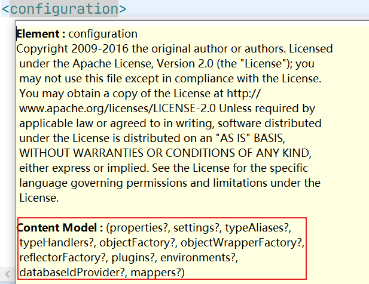
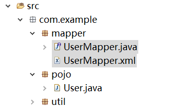

# 核心配置文件

## 前言

**C：** 在上一篇，笔者带大家对 MyBatis 的核心对象做了介绍。本篇，笔者将继续带你学习 MyBatis，掌握对核心配置文件的使用。

MyBatis 的核心/全局配置文件 mybatis-config.xml ，顾名思义就是对 MyBatis 系统的核心设置文件。包含有 MyBatis 运行时行为配置、类型别名配置、环境配置等。

下方是核心配置文件的标签模板，笔者将对其中常用的一些标签的常用使用方式进行介绍。

configuration 根节点
- **properties**  属性配置

- settings  运行时行为配置
- **typeAliases**  类型别名配置
- typeHandlers  类型处理器

- objectFactory  对象工厂
- plugins  插件配置
- **environments**  环境配置
  - environment  单个环境配置
    - transactionManager 事务管理器配置
    - dataSource  数据源配置
- databaseIdProvider 数据库厂商标识
- **mappers**  映射器配置

::: tip 笔者说
这些标签在使用时一定要注意标签的顺序和允许使用次数。Eclipse 中可以通过在标签上按 F2 查看该标签下的内容模型，即标签的顺序和允许使用次数。你看下图中画圈处就是各个标签的顺序，后面的 ?号 代表指定标签最多允许使用一次。
:::


## properties元素

如果你学过 Maven，那 properties 元素应该不难理解。在 MyBatis 的核心配置文件中，有很多配置是可能经常需要变动或复用的，如果直接将值硬编码在对应位置，将不利于统一维护管理和复用。

properties 元素的作用就体现出来了，它的使用方式有两种。

### 内部编写

**第一种使用方式，是内部编写配置** ，示例如下： 

```xml
<?xml version="1.0" encoding="UTF-8"?>
<!DOCTYPE configuration
PUBLIC "-//mybatis.org//DTD Config 3.0//EN"
"http://mybatis.org/dtd/mybatis-3-config.dtd">
<configuration>
    <!-- 要配置哪些属性是根据你项目需求来定的，笔者仅仅做一个示例而已 -->
    <properties>
        <property name="mysql.driver" value="com.mysql.jdbc.Driver"/>
        <property name="mysql.url" value="jdbc:mysql://localhost:3306/mybatis_demo_db"/>
        <property name="mysql.username" value="root"/>
        <property name="mysql.password" value="root"/>
        <property name="txType" value="JDBC"/>
    </properties>
    <!-- ...略... -->
    <environments default="develop">
        <!-- 单个环境配置 -->
        <environment id="develop">
            <!-- 事务管理配置 -->
            <transactionManager type="${txType}"/>
            <!-- 数据源配置 -->
            <dataSource type="POOLED">
                <property name="driver" value="${mysql.driver}"/>
                <property name="url" value="${mysql.url}"/>
                <property name="username" value="${mysql.username}"/>
                <property name="password" value="${mysql.password}"/>
            </dataSource>
        </environment>
    </environments>
    <!-- ...略... -->
</configuration>
```

### 外部引入

**第二种使用方式，是在外部配置文件编写配置，然后通过 properties 引入外部配置** ，示例如下： 

在 classpath 下 添加 一个 properties 配置文件，记录各种配置信息。（此处笔者记录的是数据源信息）

```
# MySQL 
mysql.driver=com.mysql.jdbc.Driver
mysql.url=jdbc:mysql://localhost:3306/mybatis_demo_db
mysql.username=root
mysql.password=root
```
```xml
<?xml version="1.0" encoding="UTF-8"?>
<!DOCTYPE configuration
PUBLIC "-//mybatis.org//DTD Config 3.0//EN"
"http://mybatis.org/dtd/mybatis-3-config.dtd">
<configuration>
    <!-- 加载外部的配置文件 -->
    <properties resource="db.properties"/>
    <!-- ...略... -->
    <environments default="develop">
        <!-- 单个环境配置 -->
        <environment id="develop">
            <!-- 事务管理配置 -->
            <transactionManager type="JDBC"/>
            <!-- 数据源配置 -->
            <dataSource type="POOLED">
                <property name="driver" value="${mysql.driver}"/>
                <property name="url" value="${mysql.url}"/>
                <property name="username" value="${mysql.username}"/>
                <property name="password" value="${mysql.password}"/>
            </dataSource>
        </environment>
    </environments>
    <!-- ...略... -->
</configuration>
```

::: tip 笔者说
大家猜一下，如果这两种方式在同时使用时遇到了相同配置，那么哪种方式的配置会生效呢？

测试思路： 可以先故意改错内部配置方式的 mysql.password 值，如果测试运行正常，说明外部配置生效了，反之则内部配置生效了。 也可以再故意调错外部的值试试。
:::

```xml
<properties resource="db.properties">
 <property name="mysql.password" value="root"/>
 <property name="txType" value="JDBC"/>
</properties>
```

## settings元素(下篇讲解)

settings 元素是用来设置和改变 MyBatis 在运行时的一些行为的。

| **设置项**          |                           **描述**                           |      **允许值**       | **默认值** |
| ------------------- | :----------------------------------------------------------: | :-------------------: | :--------: |
| cacheEnabled        |        对在此配置文件下的所有cache进行全局性开/关设置        |    true  \| false     |    true    |
| lazyLoadingEnabled  | 全局性设置懒加载。如果设为false，则所有相关联的都会被初始化加载 |    true  \| false     |    true    |
| autoMappingBehavior |             MyBatis对于resultMap自动映射匹配级别             | NONE\|PARTIAL  \|FULL |  PARTIAL   |
| **……(9个)**         |                          **......**                          |      **......**       | **......** |

## typeAlias元素

在 SQL 映射文件中，我们在使用到某些类型时，需要编写好对应的全类名，大量的使用时，繁琐不说还容易错，如下 resultType 属性示例。

```xml
<select id="selectList" resultType="com.example.pojo.User">
    SELECT * FROM `user`
</select>
```

而typeAlias 元素就可以解决此问题，通过它的配置，可以为指定类型配置好别名，这样在 SQL 映射文件中就可以不用写全限定类名，而是直接使用配置的类型别名了。它的使用方式也有两种。

### 单个配置

**第一种使用方式：挨个对不同类型进行别名配置。** 

```xml
<typeAliases>
    <!-- 
        单个类型的别名配置（如果类型多，需要配置大量的该标签）
        type：指定类型的全类名
        alias：该类型的别名
    -->
    <typeAlias type="com.example.pojo.User" alias="User"/>
</typeAliases>
```

### 包扫描

**第二种使用方式：当要配置别名的类型都在指定的 package 下时，可以直接开启包扫描，批量实现别名自动配置。** 

```xml
<!-- 类型别名配置 -->
<typeAliases>
    <!-- 
        会自动对指定包(包含其子包)下的类进行别名注册
        注册的别名是：该类型的类名小写
        例如：User类自动注册的别名是user
    -->
    <package name="com.example.pojo"/>
</typeAliases>
```

### 使用效果

下方是有了类型别名配置之后，SQL 映射文件内使用类型的效果。

```xml
<!-- 有了别名配置，使用指定类型时，直接用它的别名即可，而且不区分大小写（原因见下方） -->
<select id="selectList" resultType="User">
    SELECT * FROM `user`
</select>
```

::: tip 笔者说
在 MyBatis 中有一个类 TypeAliasRegistry ，它的作用就是进行类型别名注册和解析，Java 中常见的类型都已经被它注册好了别名。
:::

```java
package org.apache.ibatis.type;
// ...略...
public class TypeAliasRegistry {
   /** Map<类型别名, 对应类型的Class对象> */
   private final Map<String, Class<?>> typeAliases = new HashMap<>();
   /** 在创建对象时进行常用 Java 类型的别名注册 */
   public TypeAliasRegistry() {
        // String 类型注册的别名为 string 
        registerAlias("string", String.class);

        registerAlias("byte", Byte.class);
        registerAlias("long", Long.class);
        registerAlias("short", Short.class);
        registerAlias("int", Integer.class);
        registerAlias("integer", Integer.class);
        registerAlias("double", Double.class);
        registerAlias("float", Float.class);
        registerAlias("boolean", Boolean.class);

        registerAlias("byte[]", Byte[].class);
        registerAlias("long[]", Long[].class);
        registerAlias("short[]", Short[].class);
        registerAlias("int[]", Integer[].class);
        registerAlias("integer[]", Integer[].class);
        registerAlias("double[]", Double[].class);
        registerAlias("float[]", Float[].class);
        registerAlias("boolean[]", Boolean[].class);

        registerAlias("_byte", byte.class);
        registerAlias("_long", long.class);
        registerAlias("_short", short.class);
        registerAlias("_int", int.class);
        registerAlias("_integer", int.class);
        registerAlias("_double", double.class);
        registerAlias("_float", float.class);
        registerAlias("_boolean", boolean.class);

        registerAlias("_byte[]", byte[].class);
        registerAlias("_long[]", long[].class);
        registerAlias("_short[]", short[].class);
        registerAlias("_int[]", int[].class);
        registerAlias("_integer[]", int[].class);
        registerAlias("_double[]", double[].class);
        registerAlias("_float[]", float[].class);
        registerAlias("_boolean[]", boolean[].class);

        registerAlias("date", Date.class);
        registerAlias("decimal", BigDecimal.class);
        registerAlias("bigdecimal", BigDecimal.class);
        registerAlias("biginteger", BigInteger.class);
        registerAlias("object", Object.class);

        registerAlias("date[]", Date[].class);
        registerAlias("decimal[]", BigDecimal[].class);
        registerAlias("bigdecimal[]", BigDecimal[].class);
        registerAlias("biginteger[]", BigInteger[].class);
        registerAlias("object[]", Object[].class);

        registerAlias("map", Map.class);
        registerAlias("hashmap", HashMap.class);
        registerAlias("list", List.class);
        registerAlias("arraylist", ArrayList.class);
        registerAlias("collection", Collection.class);
        registerAlias("iterator", Iterator.class);

        registerAlias("ResultSet", ResultSet.class);
   }

   /**
     * 解析别名
     * @param string 要解析的别名
     * @return 该别名对应的类型的Class对象
     */
    public <T> Class<T> resolveAlias(String string) {
        try {
            if (string == null) {
                return null;
            }
            // MyBatis 在【别名自动配置】和【解析映射文件中别名】时，对别名进行了小写转换。
            // 所以在使用别名的时候才不区分大小写。
            String key = string.toLowerCase(Locale.ENGLISH);
            Class<T> value;
            if (typeAliases.containsKey(key)) {
                value = (Class<T>) typeAliases.get(key);
            } else {
                value = (Class<T>) Resources.classForName(string);
            }
            return value;
        } catch (ClassNotFoundException e) {
            throw new TypeException("Could not resolve type alias '" + string + "'.  Cause: " + e, e);
        }
    }
    // ...略...
}
```

## environments元素

MyBatis 可以配置成适应多种环境，这种机制有助于将 SQL 映射应用于多种数据库之中，现实情况下有多种理由需要这么做。例如，开发、测试和生产环境需要有不同的配置；或者想在具有相同 Schema的多个生产数据库中使用相同的 SQL 映射。还有许多类似的使用场景。

**不过要记住：尽管可以配置多个环境，但每个 SqlSessionFactory 实例只能选择一种环境。**

所以，如果你想连接两个数据库，就需要创建两个 SqlSessionFactory 实例，每个数据库对应一个。而如果是三个数据库，就需要三个实例，依此类推，记起来很简单：        

- **每个数据库对应一个 SqlSessionFactory 实例**  [1]

```xml
<!-- 环境配置：
    可以配置多个，但生效的只能有一个
    default属性：指定生效的环境的id
-->
<environments default="develop">
    <!-- 单个环境配置 id 值须保证唯一 -->
    <environment id="develop">
        <!-- 事务管理配置
             type属性：事务管理器的类型
             可选值有 JDBC 和 MANAGED
                JDBC：这个配置直接使用了 JDBC 的提交和回滚设施，它依赖从数据源获得的连接来管理事务作用域。
                MANAGED：让容器来管理事务的整个生命周期 
        -->
        <transactionManager type="JDBC"/>
        <!-- 数据源配置
            type属性：数据源的类型
                可选值有 POOLED 、UNPOOLED、JNDI
                POOLED：使用连接池来管理连接对象，降低连接的开销
                UNPOOLED：不采用连接池，每次都会进行连接打开和关闭
                JNDI：了解，采用 JNDI 来获取数据源，这种方式不用配置下方的 property。
                    它当初出现的目的就是为了能在同一个应用服务器内的不同应用间共享数据源
        -->
        <dataSource type="POOLED">
            <!-- 下方只是最重要的四项配置，不同类型数据源有不同额外配置 -->
            <property name="driver" value="${mysql.driver}"/>
            <property name="url" value="${mysql.url}"/>
            <property name="username" value="${mysql.username}"/>
            <property name="password" value="${mysql.password}"/>
        </dataSource>
    </environment>
</environments>
```

## mappers元素

mappers 元素的作用就是用来告诉 MyBatis 去哪找我们编写的 SQL 语句，它的使用方式有两大类。

### 指定映射文件

这类方式主要是告诉 MyBatis 我们所编写的 SQL 映射文件的地址，我们之前在 [《快速入门》](./01-快速入门) 中使用的就是属于这类方式。它有两种实现：

```xml
<!-- 使用相对于类路径的资源引用，有多少 SQL 映射文件就写多少个 mapper 配置 -->
<mappers>
    <mapper resource="com/example/mapper/UserMapper.xml"/>
</mappers>
```

```xml
<!-- 使用完全限定资源定位符（URL） （很少使用） -->
<mappers>
    <mapper url="file:///E:/eclipse-workspace/mybatis-1/src/com/example/mapper/UserMapper.xml"/>
</mappers>
```

### 指定Mapper接口[重要]

这类方式还要涉及到 SqlSession 对象的另一个使用形式：**Mapper接口开发** 

我们之前使用 SqlSession 是让它来直接执行指定的 SQL 语句。这种方式需要指明 SQL 映射文件 namespace的名字以及 SQL 语句的 id。因为是硬编码在代码中，维护时有诸多不便，例如：容易写错不说，还不利于我们在持久层采用面向接口编程思想。

```java
// 执行 SQL 语句
List<User> userList = sqlSession.selectList("userMapper.selectList");
```

而 Mapper 接口开发就可以有效解决此问题，实现方式如下：

**第一步：先创建一个 Mapper 接口。** 前期就养成一个开发习惯，保持 Mapper 接口和对应 SQL 映射文件同名同包（虽然目前不同名也没事，但是先听话，养成习惯）。

```java
public interface UserMapper {

    /**
     * 查询用户列表
     * @return
     */
    List<User> selectList();
	
}
```



**第二步：将 SQL 映射文件的 namespace 值改为对应 Mapper 接口的全限定类名。** 

```xml
<?xml version="1.0" encoding="UTF-8"?>
<!DOCTYPE mapper
PUBLIC "-//mybatis.org//DTD Mapper 3.0//EN"
"http://mybatis.org/dtd/mybatis-3-mapper.dtd">
<mapper namespace="com.example.mapper.UserMapper">
</mapper>
```

**第三步：将 SQL 映射文件中的 SQL 语句和 Mapper 接口中的方法进行绑定。** 

```xml
<?xml version="1.0" encoding="UTF-8"?>
<!DOCTYPE mapper
PUBLIC "-//mybatis.org//DTD Mapper 3.0//EN"
"http://mybatis.org/dtd/mybatis-3-mapper.dtd">
<mapper namespace="com.example.mapper.UserMapper">
    <!-- 与 Mapper 接口的方法绑定
        id 就是 Mapper 接口中的对应方法名
        resultType 就是 Mapper 接口中的返回值类型，如果返回值类型时集合，则写它的泛型
    -->
    <select id="selectList" resultType="User">
        SELECT * FROM `user`
    </select>
</mapper>
```

**最后，我们在核心配置文件中，再配置好 Mapper 接口的全限定类名即可。** 

```xml
<!-- 使用 Mapper 接口的完全限定类名 -->
<mappers>
    <mapper class="com.example.mapper.UserMapper"/>
</mappers>
```

**测试一下。** 

```java
@Test
void testSelectList() throws IOException {
	
    // 获取SqlSession对象
    try (SqlSession sqlSession = MyBatisUtils.openSession()){
		
        // 获取 Mapper 接口，而不再直接执行 SQL 语句
        // 和以前 DAO 模式就非常相像了，只不过是 DAO 实现类变为了 SQL 映射文件
        UserMapper userMapper = sqlSession.getMapper(UserMapper.class);
        // 执行方法
        List<User> userList = userMapper.selectList();
		
        // 遍历数据
        userList.forEach(System.out::println);
    } catch (Exception e) {
        e.printStackTrace();
    }
}
```

另外，在核心配置文件中，大量的配置 Mapper 接口全限定类名，还是有些麻烦，所以 MyBatis 在这也支持包扫描配置。

```xml
<!-- 包扫描，将指定包(及其子包)下的 Mapper 接口全部注册为映射器 -->
<mappers>
    <package name="com.example.mapper"/>
</mappers>
```

::: warning 笔者说
Mapper 接口开发是我们以后主要使用的方式，必须掌握！
:::

## 参考文献

[1]MyBatis 官网. MyBatis 配置[EB/OL]. https://mybatis.org/mybatis-3/zh/configuration.html. 2020-12-26

## 后记

::: info 笔者说
对于技术的学习，笔者一贯遵循的步骤是：先用最最简单的 demo 让它跑起来，然后学学它的最最常用 API 和 配置让自己能用起来，最后熟练使用的基础上，在空闲时尝试阅读它的源码让自己能够洞彻它的运行机制，部分问题出现的原因，同时借鉴这些技术实现来提升自己的代码高度。

所以在笔者的文章中，前期基本都是小白文，仅仅穿插很少量的源码研究。当然等小白文更新多了，你们还依然喜欢，后期会不定时专门对部分技术的源码进行解析。
:::
