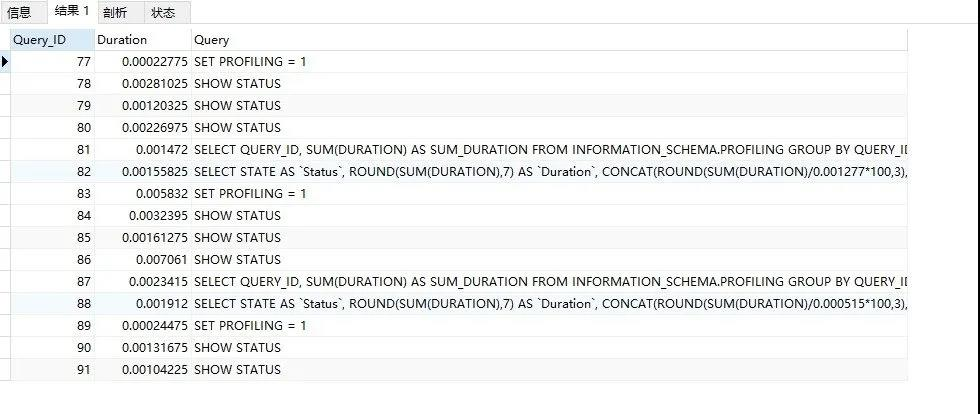

# 个人 SQL 优化技巧 <Badge text="持续更新" type="warning" />

<!-- more -->

## 1、查询优化

### LIMIT 加上分页最大值

```sql
SELECT * 
FROM   operation 
WHERE  type = 'SQLStats'
AND name = 'SlowLog'
ORDER  BY create_time 
LIMIT  1000, 10;
```

随着偏移量增大，查询时间也会增大。

要知道数据库也并不知道第1000000条记录从什么地方开始，即使有索引也需要从头计算一次。出现这种性能问题，既然是使用create_time做排序，那么可以使用上一页的最大值create_time当成参数作为查询条件，灵活的解决问题，SQL重新设计如下

```sql
SELECT * 
FROM   operation 
WHERE  type = 'SQLStats'
AND name = 'SlowLog'
AND create_time > '2017-03-16 14:00:00'
ORDER  BY create_time 
LIMIT 10;
```

查询时间基本固定，不会随着数据量的增长而发生变化。


### 判断存在

根据某一条件从数据库表中查询 『有』与『没有』，只有两种状态，没必要用select count(*)，很多人的写法是这样的：

::: code-group

```sql [SQL]
SELECT count(*) FROM table WHERE a = 1 AND b = 2  
```

```java [Java]
int nums = xxDao.countXxxxByXxx(params);  
if ( nums > 0 ) {  
  //当存在时，执行这里的代码  
} else {  
  //当不存在时，执行这里的代码  
}  
```

:::

推荐写法：

::: code-group

```sql [SQL]
SELECT 1 FROM table WHERE a = 1 AND b = 2 LIMIT 1  
```

```java [Java]
Integer exist = xxDao.existXxxxByXxx(params);  
if ( exist != NULL ) {  
  //当存在时，执行这里的代码  
} else {  
  //当不存在时，执行这里的代码  
}
```

:::

SQL不再使用`count`，改用`LIMIT 1`，让数据库查询时遇到一条就返回，不要再继续查找还有多少条，业务代码中直接判断是否非空即可，根据查询条件查出来的条数越多，性能提升的越明显。

### 连接查询替代子查询

> Exists 转Join连接

MySQL 对待 EXISTS 子句时，仍然采用嵌套子查询的执行方式，如下面的 SQL 语句

```sql
SELECT * FROM my_neighbor n 
	LEFT JOIN my_neighbor_apply sra ON n.id = sra.neighbor_id AND sra.user_id = 'xxx'
WHERE n.topic_status < 4
AND EXISTS(SELECT 1 FROM  message_info m WHERE  n.id = m.neighbor_id 
           AND m.inuser = 'xxx') 
AND n.topic_type <> 5
```

查看执行计划


`DEPENDENT SUBQUERY`表示使用了嵌套子查询，去掉exists 更改为 join连接，将执行时间从1.93秒降低为1毫秒，修改如下：

```sql
SELECT * FROM my_neighbor n 
  INNER JOIN message_info m ON n.id = m.neighbor_id and m.inuser='xxx'
	LEFT JOIN my_neighbor_apply sra ON n.id = sra.neighbor_id AND sra.user_id = 'xxx'
WHERE n.topic_status < 4
AND n.topic_type <> 5
```

新的执行计划


难道exists 与 in 关键字都要使用join连接去优化？看执行计划是否使用了DEPENDENT SUBQUERY嵌套子查询。

> IN转Join 连接

mysql执行子查询时，需要创建临时表，查询完毕后，需要再删除这些临时表，有一些额外的性能消耗。

```sql [SQL]
select * from order
where user_id in (select id from user where status=1)

-- 改成连接查询
select o.* from order o
inner join user u on o.user_id = u.id
where u.status=1
```


### 避免隐式类型转换 <Badge text="强制" type="danger" />

我们在使用 MySQL 时，或多或少都感受过 MySQL 的隐式类型转换。例如：user_id 是整数类型，但是依然可以使用字符串类型数据来进行判断。MySQL 帮你做完这种隐式类型转换是有代价的，什么代价呢？ **索引不再生效了而已** 。

::: code-group
```sql [正例]
SELECT * FROM `sys_user` WHERE `user_id` = 10;
```

```sql [反例]
SELECT * FROM `sys_user` WHERE `user_id` = '10';
```
:::

### 关联更新、删除

```sql
UPDATE operation o 
SET  status = 'applying' 
WHERE  o.id IN (
  SELECT id 
  FROM (SELECT o.id, 
          o.status 
          FROM   operation o 
          WHERE  o.group = 123 
          AND o.status NOT IN ( 'done' ) 
          ORDER  BY o.parent, 
          o.id 
          LIMIT  1) t);
```

MySQL 实际执行的是循环/嵌套子查询（DEPENDENT SUBQUERY)，执行计划如下：


重写为 JOIN 之后，子查询的选择模式从 DEPENDENT SUBQUERY 变成 DERIVED，执行速度大大加快，从7秒降低到2毫秒。

```sql
UPDATE operation o 
       JOIN  (SELECT o.id, 
              o.status 
              FROM   operation o 
              WHERE  o.group = 123 
              AND o.status NOT IN ( 'done' ) 
              ORDER  BY o.parent, 
              o.id 
              LIMIT  1) t
         ON o.id = t.id 
SET  status = 'applying' 
```

执行计划简化为：


想想merge into语句也是使用关联去插入、更新的。

### UNION优化混合排序

```sql
SELECT * 
FROM   my_order o 
INNER JOIN my_appraise a ON a.orderid = o.id 
ORDER  BY a.is_reply ASC, 
          a.appraise_time DESC
LIMIT  0, 20
```


MySQL 不能利用索引进行混合排序。但在某些场景，还是有机会使用特殊方法提升性能的。<font color=red>由于 is_reply 只有0和1两种状态</font>，我们使用 unit 的方法重写后，执行时间从1.58秒降低到2毫秒。

```sql
SELECT * 
FROM (
  (SELECT * FROM  my_order o INNER JOIN my_appraise a ON a.orderid = o.id 
   AND is_reply = 0
   ORDER  BY appraise_time DESC
   LIMIT  0, 20) 
  UNION ALL
  (SELECT * FROM  my_order o INNER JOIN my_appraise a ON a.orderid = o.id 
   AND is_reply = 1
   ORDER  BY appraise_time DESC
   LIMIT  0, 20)) t 
ORDER  BY  is_reply ASC,appraisetime DESC
LIMIT  20;
```

### 提前缩小范围

```sql
SELECT * 
FROM my_order o 
LEFT JOIN my_userinfo u 
ON o.uid = u.uid
LEFT JOIN my_productinfo p 
ON o.pid = p.pid 
WHERE o.display = 0 AND o.ostaus = 1 
ORDER  BY o.selltime DESC
LIMIT  0, 15
```

该SQL语句原意是：先做一系列的左连接，然后排序取前15条记录。从执行计划也可以看出，最后一步估算排序记录数为90万，时间消耗为12秒。

我们可以先对my_order排序获取前15条记录，再做左连接，SQL重写如下

```sql
SELECT * FROM (
  SELECT * 
  FROM   my_order o 
  WHERE  ( o.display = 0 ) 
  AND ( o.ostaus = 1 ) 
  ORDER  BY o.selltime DESC
  LIMIT  0, 15
) o 
LEFT JOIN my_userinfo u ON o.uid = u.uid 
LEFT JOIN my_productinfo p ON o.pid = p.pid 
ORDER BY  o.selltime DESC limit 0, 15
```

再检查执行计划：子查询物化后（select_type=DERIVED)参与 JOIN。虽然估算行扫描仍然为90万，但是利用了索引以及 LIMIT 子句后，实际执行时间变得很小。

### WITH语句结果集

看下面这个已经初步优化过的例子

```sql
SELECT a.*,c.allocated 
FROM ( 
  SELECT   resourceid 
  FROM     my_distribute d 
  WHERE    isdelete = 0
  	AND      cusmanagercode = '1234567'
  ORDER BY salecode limit 20) a 
LEFT JOIN (
  SELECT resourcesid,sum(ifnull(allocation, 0) * 12345) allocated 
  FROM   my_resources 
  GROUP BY resourcesid) c ON a.resourceid = c.resourcesid
```

发现 c 表是全表扫描查询的，如果数据量大就会导致整个语句性能下降，左连接最后结果集只关心能和主表 resourceid 能匹配的数据，这是一个优化点，提前缩小范围，过滤掉不匹配的数据，使用with语句重写如下：

```sql
with a as (
  SELECT   resourceid 
  FROM     my_distribute d 
  WHERE    isdelete = 0
  AND      cusmanagercode = '1234567'
  ORDER BY salecode limit 20 
)
select a.*,c.allocated
from a left join (
  SELECT resourcesid,sum(ifnull(allocation, 0) * 12345) allocated 
  FROM my_resources r,a
  where a.resourceid = r.resourcesid
  GROUP BY resourcesid
) c on a.resourceid = c.resourcesid
```

数据库编译器产生执行计划，决定着SQL的实际执行方式。但是编译器只是尽力服务，所有数据库的编译器都不是尽善尽美的。程序员在设计数据模型以及编写SQL语句时，要把算法的思想意识带进来。**编写复杂SQL语句要养成使用 WITH 语句的习惯**，简洁且思路清晰的SQL语句也能减小数据库的负担 。提前缩小数据查询的范围，避免不必要的数据扫描与转换操作，就好像多线程任务时如果是cpu型任务应该减少核心线程数避免频繁切换cpu带来的时间耗损，核心线程数应该少于cpu核心数。

### 避免使用select *

```sql
select * from user where id=1;
```

在实际业务场景中，可能我们真正需要使用的只有其中一两列。

- 查了很多数据，但是不用，白白浪费了数据库资源：内存或者cpu
- 多查出来的数据，通过网络IO传输，也会增加数据传输的时间
- `select *`不会走`覆盖索引`，会出现大量的`回表`操作，增加查询时间

sql语句查询时，只查需要用到的列，多余的列根本无需查出来：

```sql
select name,age from user where id=1;
```

where 条件会优先选择主键索引。为什么呢？跟 MySQL 的存储规则有关

 InnoDB 会创建主键索引，而主键索引属于聚簇索引，即存储数据时，索引是基于 B+ 树构成的，具体的行数据则存储在叶子节点。

- 通过主键索引查询的，会直接搜索 B+ 树，从而查询到数据。
- 通过非主键索引查询的，需要先搜索索引树，得到在 B+ 树上的值，再到 B+ 树上搜索符合条件的数据，这个过程就是**“回表”**

回表会产生时间损耗。

普通索引、聚集索引、覆盖索引、回表查询等概念，参考文章：https://blog.csdn.net/songjianlong/article/details/132352142

### UNION ALL 替代 UNION

union 会进行排重操作，排重的过程需要遍历、排序和比较，它更耗时，更消耗cpu资源，union all 则不会

```sql
(select * from user where id=1) 
union 
(select * from user where id=2);

-- 尽量使用 union all 替代
(select * from user where id=1) 
union all
(select * from user where id=2);
```

### 批量操作

::: code group

```java [Java]
orderMapper.insertBatch(list):
```

```sql [SQL]
-- 提供一个批量插入数据的方法
insert into order(id,code,user_id) 
values(123,'001',100),(124,'002',100),(125,'003',101);
```

:::

这样只需要远程请求一次数据库，sql性能会得到提升，数据量越多，提升越大。建议每批数据尽量控制在500以内。如果数据多于500，则分多批次处理

### 多用LIMIT

有时候，我们需要查询某些数据中的第一条，比如：查询某个用户下的第一个订单，想看看他第一次的首单时间。

```java
select id, create_date 
 from order 
where user_id=123 
order by create_date asc 
limit 1;
```

使用`limit 1`，只返回该用户下单时间最小的那一条数据即可。

> 此外，在删除或者修改数据时，为了防止误操作，导致删除或修改了不相干的数据，也可以在sql语句最后加上limit。

如：

```sql
update order set status=0,edit_time=now(3) 
where id>=100 and id<200 limit 100;
```

这样即使误操作，比如把id搞错了，也不会对太多的数据造成影响。

### 增量查询

有时候我们需要通过远程接口查询数据，然后同步到另外一个数据库

```sql
select * from user;
```

如果直接获取所有的数据，然后同步过去。这样虽说非常方便，但是带来了一个非常大的问题，就是如果数据很多的话，查询性能会非常差。

```sql [正例]
select * from user 
where id>#{lastId} and create_time >= #{lastCreateTime} 
limit 100;
```

按id和时间升序，每次只同步一批数据，这一批数据只有100条记录。每次同步完成之后，保存这100条数据中最大的id和时间，给同步下一批数据的时候用。

通过这种增量查询的方式，能够提升单次查询的效率。

### JOIN 表不宜过多

根据阿里巴巴开发者手册的规定，join表的数量不应该超过`3`个。所以常建议单表查询。

如果join太多，mysql在选择索引的时候会非常复杂，很容易选错索引。如果没有命中索引导致nested loop join ，分别从两个表读一行数据进行两两对比，复杂度是 n^2。

```sql [正例]
select a.name,b.name.c.name,a.d_name 
from a 
inner join b on a.id = b.a_id
inner join c on c.b_id = b.id
```

还有可以通过冗余字段的方式避免查询多张表。

### LEFT JOIN 与 INNER JOIN

关联表查询使用最多的是left join和inner join

- `left join`：求两个表的交集外加左表剩下的数据。
- `inner join`：求两个表交集的数据。

```sql
select o.id,o.code,u.name 
from order o 
inner join user u on o.user_id = u.id
where u.status=1;
```

如果两张表使用inner join关联，mysql会自动选择两张表中的小表，去驱动大表，所以性能上不会有太大的问题。

```
select o.id,o.code,u.name 
from order o 
left join user u on o.user_id = u.id
where u.status=1;
```

如果两张表使用left join关联，mysql会默认用left join关键字左边的表，去驱动它右边的表。如果左边的表数据很多时，就会出现性能问题，所以左边要用小表，如果能用inner join的地方，尽量少用left join。

### 提升GROUP BY的效率

我们有很多业务场景需要使用`group by`关键字，它主要的功能是去重和分组。

通常它会跟`having`一起配合使用，表示分组后再根据一定的条件过滤数据。

```sql [反例]
select user_id,user_name from order
group by user_id
having user_id <= 200;
```

它先把所有的订单根据用户id分组之后，再去过滤用户id大于等于200的用户。分组是一个相对耗时的操作，为什么我们不先缩小数据的范围之后，再分组呢？

```sql [正例]
select user_id,user_name from order
where user_id <= 200
group by user_id
```

分组前就把多余的数据过滤掉了，这样分组时效率就会更高一些。

### Explain 分析执行计划

sql语句走索引和没走索引，执行效率区别是很大的，使用 explain 命令查看执行计划

```sql
explain select * from `order` where code='002';
```


执行计划各列的含义如下：


1、id :每个执行计划都会有一个 id ，如果是一个联合查询的话，这里就会显示好多个 id

2、select_type：select 查询类型，

-  SIMPLE 普通查询，也就是没有联合查询/子查询)
- PRIMARY 主查询 
- UNION ( UNION 中后面的查询)
- SUBQUERY 子查询

3、table :执行查询计划的表

4、type :查询所执行的方式，这是咱们在分析 SQL 时候一个非常重要的指标，这个值从好到坏依次是: system > const > eq_ref > ref > range > index > ALL

- system/const :说明表中只有一行数据匹配，这个时候根据索引查询一次就能找到对应的数据

- eq_ref :使用唯一索引扫描，这个经常在多表连接里面，使用主键和唯一索引作为关联条件时可以看到

- ref :非唯一索引扫描，也可以在唯一索引最左原则匹配扫描看到

- range :索引范围扫描，比如查询条件使用到了 < ， > ， between 等条件

- index :索引全表扫描，这个时候会遍历整个索引树

- ALL :表示全表扫描，也就是需要遍历整张表才能找到对应的行

5、possible_keys :表示可能使用到的索引

6、key :实际使用到的索引

7、key_len :使用的索引长度

8、ref :关联 id 等信息

9、rows :找到符合条件时，所扫描的行数，在这里虽然有 10 万条数据，但是因为索引的缘故，所以扫描了 99 行的数据

10、Extra :额外的信息

- Using where :不用读取表里面的所有信息，只需要通过索引就可以拿到需要的数据，这个过程发生在对表的全部请求列都是同一个索引部分时
- Using temporary :表示 mysql 需要使用临时表来存储结果集，常见于 group by / order by
- Using filesort :当查询的语句中包含 order by 操作的时候，而且 order by 后面的内容不是索引，这样就没有办法利用索引完成排序，就会使用"文件排序"
- Using join buffer :使用了连接缓存
- Using index :使用了覆盖索引

有时候mysql会选错索引，使用 `force index`来强制走某个索引。

### Show Profile分析耗时

`SHOW PROFILES;` 语句查询最近发送给服务器的 SQL 语句，默认情况下记录最近已经执行的 15 条记录，如下图：



如果我想看具体SQL语句的耗时分析，怎么办？ 

```sql
SHOW PROFILE FOR QUERY 82; -- 82是Query_ID 列的值
```

 

可以看到Sending data 耗时是最长的，这是因为此时 mysql 线程开始读取数据并且把这些数据返回到客户端，在这个过程中会有大量磁盘 I/O 操作。

通过这样的分析，我们就能知道， SQL 语句在查询过程中，到底是 磁盘 I/O 影响了查询速度，还是 System lock 锁等待影响了查询速度。

## 2、数据库表设计

### 列名带上前缀 

部分列名带上前缀或缩写，可以有效减少在连接查询、ORM 映射等场景下刻意起别名或思考区分不同的问题。

::: code-group
```sql [正例]
CREATE TABLE `sys_customer` (
  `customer_id` bigint(20) UNSIGNED NOT NULL AUTO_INCREMENT COMMENT '客户ID',
  `customer_name` varchar(255) NOT NULL COMMENT '客户名称',
  PRIMARY KEY (`customer_id`) USING BTREE,
) COMMENT = '客户表';

CREATE TABLE `sys_contact_user` (
  `contact_user_id` bigint(20) UNSIGNED NOT NULL AUTO_INCREMENT COMMENT '联系人ID',
  `contact_user_name` varchar(255) NOT NULL COMMENT '联系人名称',
  `customer_id` bigint(20) UNSIGNED NOT NULL COMMENT '客户ID',
  PRIMARY KEY (`contact_user_id`) USING BTREE,
) COMMENT = '联系人表';

# 连接查询，你完全不需要用脑去考虑到底是 c.`id` 还是 cu.`customer_id` 的问题，都是 `customer_id`
SELECT * FROM `sys_customer` c 
LEFT JOIN `sys_contact_user` cu ON c.`customer_id` = cu.`customer_id`
```
:::

### 选择合理的字段类型

我们在选择表字段类型时，应该遵循这样的原则：

1. 能用数字类型，就不用字符串，因为字符的处理往往比数字要慢。
2. 尽可能使用小的类型，比如：用bit存布尔值，用tinyint存枚举值等。
3. 长度固定的字符串字段，用char类型。
4. 长度可变的字符串字段，用varchar类型。
5. 金额字段用decimal，避免精度丢失问题。

> char 与 varchar

`char`固定字符串类型，该类型的字段存储空间是固定的，会浪费存储空间，如果是长度固定的字段，比如用户手机号一般都是11位的，可以定义成char类型，长度是11字节

```sql
alter table order 
add column mobile char(11) NOT NULL;
```

`varchar`变长字符串类型，该类型的字段存储空间会根据实际数据的长度调整，不会浪费存储空间。

```sql
alter table order 
add column code varchar(20) NOT NULL;
```

### 非负数列添加UNSIGNED无符号约束 <Badge text="建议" />

在大部分的数据存储场景中，我们只会使用正整数，如果能确定该列为非负数，建议添加 `UNSIGNED` 无符号约束。

::: code-group
```sql [正例]
# 不添加 UNSIGNED 约束，取值范围
TINYINT：[-128, 127]
# 添加 UNSIGNED 约束，取值范围
TINYINT：[0, 255]
```
:::

### 合理采用整数类型 <Badge text="建议" />

例如：状态类的信息，状态再多能有多少个，采用 `TINYINT` 即可，减少存储空间占用。

下方表数据整理于：[MySQL 5.7官方文档/数据类型/数值数据类型/整数类型](https://dev.mysql.com/doc/refman/5.7/en/integer-types.html)

| 类型      | 存储（字节） | 取值范围                  | 取值范围（无符号） |
| :-------- | :----------- | :------------------------ | :----------------- |
| TINYINT   | 1            | [-128, 127]               | [0, 255]           |
| SMALLINT  | 2            | [-32768, 32767]           | [0, 65535]         |
| MEDIUMINT | 3            | [-8388608, 8388607]       | [0, 16777215]      |
| INT       | 4            | [-2147483648, 2147483647] | [0, 4294967295]    |
| BIGINT    | 8            | [-2^63^, 2^63^-1]         | [0, 2^64^-1]       |

### 布尔列采用bit类型 <Badge text="建议" />

例如：是否删除这种只有两种状态的信息，在表设计时建议对该列设置 `bit` 类型（0表示否/假/false，1表示是/真/true），在程序语言中可以采用 boolean 类型对应。

::: code-group
```sql [SQL]
`is_deleted` bit(1) NOT NULL DEFAULT '0' COMMENT '是否已删除（0否 1是）'
```

```java [Java]
@Data
public class User {
    /**
     * 是否已删除（0否 1是）
     */
    private Boolean isDeleted;
}
```
:::

### 数据表ID必须有序

一般情况使用id自增（数据库的id作为唯一标识），分库分表的情况下，使用分布式的高并发唯一 id 生成器来生成全局id如雪花ID，innodb引擎的表数据是按照id 排序存储的，所以使用id来限定范围查询，能提高好几倍的查询速度，即先 select id，然后再 select * where id>= ，限定id的范围。id不要使用uuid，它是无序的会导致索引重新排序。

### 控制索引的数量

阿里巴巴的开发者手册中规定，单表的索引数量应该尽量控制在`5`个以内，并且单个索引中的字段数不超过`5`个。

mysql使用B+树结构来保存索引的，insert、update和delete操作时，会同时更新B+树索引。如果索引过多，会消耗更多多额外的性能。

- 如果你的系统并发量不高，表中的数据量也不多，超过5个索引也是可以的。
- 高并发的系统，请务必遵守单表索引数量不要超过5的限制。

高并发系统如何优化索引数量？

- 能够建组合索引，就别建单字段索引，删除无用的单字段索引；
- 将部分查询功能迁移到其他类型的数据库中，比如：ElasticSeach、HBase等，在业务表中只需要建几个关键索引即可。

## 3、数据库设计

### 采用utf8mb4编码 <Badge text="建议" />

::: tip 如果要存储特殊字符（例如：emoij表情符），使用 utf8mb4 编码。
MySQL 5.5.3 后增加了一个新的编码： `utf8mb4` ，其中 mb4 是 most bytes 4 的意思，用于兼容四字节的 unicode。  

`utf8mb4` 是 utf8 的超集，除了将编码改为 `utf8mb4` 外不需要做其他转换。  

设计数据库时如果想要允许用户使用特殊符号，最好使用 `utf8mb4` 编码来存储，使得数据库有更好的兼容性，但是这样设计会导致耗费更多的存储空间。
:::

