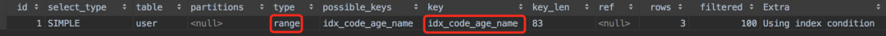
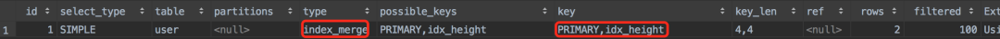
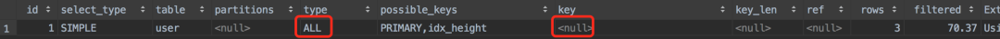
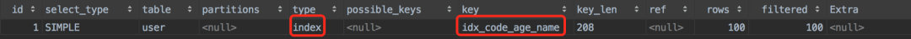
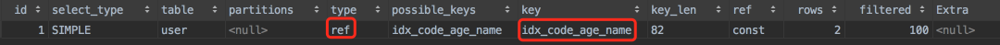
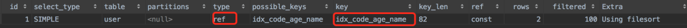
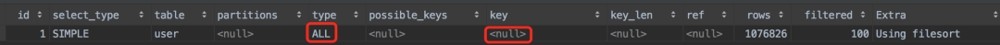

# 索引失效的10个场景

user表

```sql
CREATE TABLE `user` (
  `id` int NOT NULL AUTO_INCREMENT comment '主键',
  `code` varchar(20) COLLATE utf8mb4_bin DEFAULT NULL comment '',
  `age` int DEFAULT '0',
  `name` varchar(30) COLLATE utf8mb4_bin DEFAULT NULL,
  `height` int DEFAULT '0',
  `address` varchar(30) COLLATE utf8mb4_bin DEFAULT NULL,
  PRIMARY KEY (`id`),
  KEY `idx_code_age_name` (`code`,`age`,`name`),
  KEY `idx_height` (`height`)
) 
```

## 1、不满足最左匹配原则

联合索引`idx_code_age_name`的索引字段顺序是code->age->name，只要组合索引的最左字段code在where条件中，该索引都会生效，这就是<mark>最左匹配原则</mark>

```sql
explain select * from user where code = '101';
explain select * from user where code= '101' and age=21;
explain select * from user where code= '101' and age=21 and name = '周星驰';
explain select * from user where name = '周星驰' and code= '101' and age=21;
```

执行计划：


type = ref 代表使用的是非唯一索引扫描

没有了最左边的code字段，那么联合索引就会失效

```sql
explain select * from user where age=21;
explain select * from user where name = '周星驰';
```

执行计划


## 2、使用了select *

《阿里巴巴开发手册》中说过，查询sql中禁止使用select *

```sql
explain select * from user where name = '周星驰';
```


type=all 走了全表扫描，没有用索引，如果查询我们真正需要的列，同时那些列是有索引的，结果会怎样?

```sql
explain select code,name from user where name = '周星驰';
```


type=index，`索引全表扫描`，比type = all 全表扫描效率更高，但是比前面的type=ref 效率要低一些。注意 Extra字段`Using where;Using index`

- Using where :不用读取表里面的所有信息，只需要通过索引就可以拿到需要的数据，这个过程发生在对表的全部请求列都是同一个索引部分时
- Using index :使用了覆盖索引

如果select 语句中的查询列，都是索引列，这就是`覆盖索引`，这种情况下，查询的相关字段都能走索引，查询效率自然会更高一些。而使用`select *` ，走非索引列的数据，不会走索引，查询效率低。

## 3、索引列上有计算

会使索引失效。

## 4、索引列用了函数

```sql
explain select * from user  where height=170;
```

执行计划


可以看到使用了`idx_height`

```sql
explain select * from user  where substr(height,1,2)=17;
```

使用了截取函数，看执行计划


type=all 全表扫描，索引失效了，应该修改为

```sql
select * from user  where height >= 170;
```

## 5、字段类型不同

在sql语句中因为字段类型不同，导致索引失效的问题，很容易遇到，是我们日常工作中最容易忽视的问题。举例，user表中的code字段是varchar字符类型的，如果sql语句写成这样：

```sql
explain select * from user where code=101;
```

因为code字段类型varchar，而传参的类型是int，两种类型不同，sql语句会走全表扫描，索引失效。

但有一种特殊情况，user表中的height字段是int类型的，查询时加了引号

```sql
explain select * from user where height='175';
```

执行计划：


依然可以走索引，为什么会这样？

因为mysql做了隐形转换，当它发现int类型字段作为查询条件时，会自动将字段的传参进行隐形转换，把字符串类型转成int类型，所以'175' 变成了 175 ，索引依然生效。

```sql
select 1 + '1';
```

结果是多少，隐形转换，mysql自动把字符串1，转换成了int类型的1，然后变成了：1+1=2。

如果想字符串拼接，用concat函数

```sql
select concat(1,'1');
```

**为什么字符串类型的字段，传入了int类型的参数时索引会失效呢？**

根据mysql 官网解释，字符串'1'、' 1 '、'1a'都能转换成int类型的1，也就是说可能会出现多个字符串，对应一个int类型参数的情况。反过来，mysql就不知道int类型的1转换成哪种字符串，用哪个索引值查询了。

## 6、like左边包含%

场景：查询所有code是10开头的用户

```sql
explain select * from user where code like '10%';
```

执行结果：



type=range  走了范围索引

百分号在左边，则索引失效

```sql
explain select * from user where code like '%1';
```

因为索引就是二叉树，它是按照大小进行比较排序的，就像字典的目录，它是按字母从小到大，从左到右排序的。

## 7、使用or 关键字

我们平时写sql使用or关键字的场景非常多，如果不注意就很容易让索引失效

场景：查一下id=1或者height=175的用户

```sql
explain select * from user where id=1 or height=175
```

执行结果：



因为刚好id和height字段都建好了索引，所以索引还是生效的。

需求改了：再增加一个条件 address = '成都'，sql改成这样：

```sql
explain select * from user where id=1 or height=175 or address='成都';
```

执行结果：



type=all 索引失效了，为什么会这样？因为最后加的address字段没有加索引，or条件下，导致其他字段的索引都失效了

> 常用的解决办法就是使用union all 关键字替代or关键字。

## 8、not in 和 not exists

sql 中常见的范围查询有：

- in
- exists
- not in
- not exists
- between and 

使用 in ，exists都会走索引，但反向就会导致索引失效

## 9、order by 的坑

### 哪些情况走索引

> 1、满足最左匹配原则

user 表有code,age,name的联合索引，配合order by排序时一定要满足最左匹配原则

```sql
explain select * from user
order by code limit 100;

explain select * from user
order by code,age limit 100;

explain select * from user
order by code,age,name limit 100;
```

执行结果：



使用了联合索引idx_code_age_name，

<mark>有个非常关键的地方，后面需要加上limit关键字，如果不加它索引会失效</mark>

> 2、配合where一起使用

```sql
explain select * from user
where code='101'
order by age;
```

发现 limit 关键字没有了，但是有where关键字，看执行结果



使用了联合索引idx_code_age_name，where条件中使用了code联合索引的第一个字段，order by 关键字使用了age联合索引的第二个字段。

如果中间层断了，索引是否会生效？

```sql
explain select * from user
where code='101'
order by name;
```

看执行结果



依然走索引，看Extra字段=filesort，只是order by的时候需要走一次 filesort 排序效率降低了。

> 3、相同的排序

order by后面如果包含了联合索引的多个排序字段，只要它们的排序规律是相同的（要么同时升序，要么同时降序），也可以走索引。

```sql
explain select * from user order by code desc,age desc limit 10;
```

执行结果：


> 4、where和limit关键字都有

```sql
explain select * from user
where code='101'
order by code, name;
```

不用说，肯定会走索引

### 哪些情况不走索引

> 1、没加where或limit

如果order by语句中没有加where或limit关键字，该sql语句将不会走索引。

```sql
explain select * from user
order by code, name;
```

执行结果：


type=all全表扫描，索引真的失效了

> 2、对不同的索引做order by

这种情况比较容易忽视

```sql
explain select * from user order by code,height limit 100;
```

执行结果：



可以看出type=all 索引失效了，code字段有联合索引，height字段也有索引，同时在order by 使用，索引就会失效。